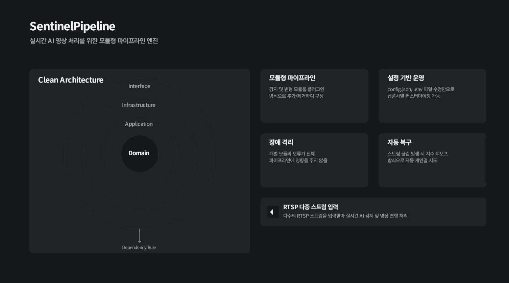
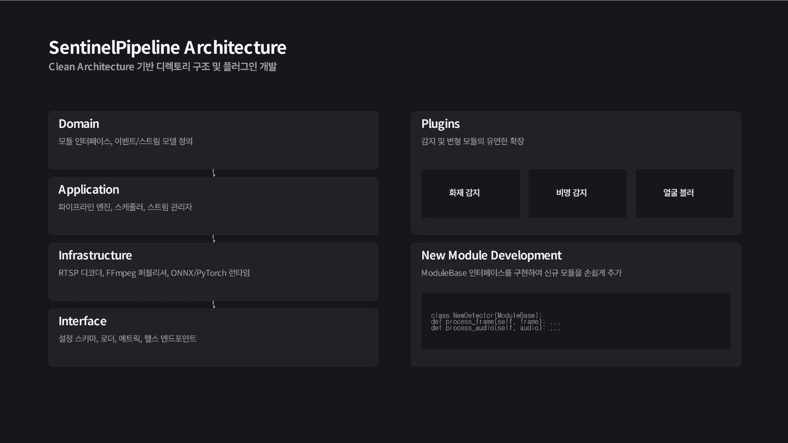

# SentinelPipeline

실시간 AI 영상 처리를 위한 모듈형 파이프라인 엔진



---

## 아키텍처





---

## 설치 및 실행

### 사전 요구사항

- Python 3.10 이상
- [uv](https://github.com/astral-sh/uv) 패키지 매니저 (또는 pip)
- FFmpeg (비디오 처리용)
- Docker 및 Docker Compose (선택사항)

### 방법 1: Docker Compose 사용 (권장)

가장 간단한 실행 방법입니다:

```bash
# Docker Compose로 실행
docker-compose up -d

# 로그 확인
docker-compose logs -f sentinel-pipeline

# 중지
docker-compose down
```

서버는 기본적으로 `http://localhost:9000`에서 실행됩니다.

### 방법 2: 로컬에서 직접 실행

1. **의존성 설치**

```bash
# uv 사용 시
uv sync

# 또는 pip 사용 시
pip install -e .
```

2. **설정 파일 준비**

`config.json` 파일이 이미 있는지 확인하세요. 없다면 `config.example.json`을 복사하여 수정하세요:

```bash
cp config.example.json config.json
# config.json을 편집하여 RTSP URL, 모델 경로 등을 설정
```

3. **프로젝트 실행**

```bash
# 방법 A: uv run 사용 (권장)
uv run python -m sentinel_pipeline.main

# 방법 B: PYTHONPATH 설정 후 실행 (Windows)
# Git Bash 또는 PowerShell에서
export PYTHONPATH=src:$PYTHONPATH  # Git Bash
# 또는
$env:PYTHONPATH="src"  # PowerShell
python -m sentinel_pipeline.main

# 방법 C: src 디렉토리에서 직접 실행
cd src
python -m sentinel_pipeline.main
```

4. **환경 변수 설정 (선택사항)**

**Linux/Mac (Git Bash 포함):**
```bash
# 설정 파일 경로 지정
export CONFIG_PATH=config.json

# 서버 호스트/포트 설정
export HOST=0.0.0.0
export PORT=8000

# CORS 설정
export CORS_ORIGINS=http://localhost:3000,http://localhost:8080
```

**Windows PowerShell:**
```powershell
$env:CONFIG_PATH="config.json"
$env:HOST="0.0.0.0"
$env:PORT="8000"
$env:CORS_ORIGINS="http://localhost:3000,http://localhost:8080"
```

서버는 기본적으로 `http://localhost:8000`에서 실행됩니다.

### 접속 확인

- API 서버: `http://localhost:8000` (또는 Docker 사용 시 `http://localhost:9000`)
- 헬스 체크: `http://localhost:8000/health`
- 관리자 대시보드: `http://localhost:8000/admin`
- API 문서: `http://localhost:8000/docs`

---

## REST API

FastAPI 기반의 HTTP API를 통해 외부에서 시스템을 제어할 수 있습니다.

| 엔드포인트 | 메서드 | 설명 |
|-----------|--------|------|
| `/health` | GET | 시스템 상태 확인 |
| `/streams` | GET | 전체 스트림 목록 조회 |
| `/streams/{id}/start` | POST | 스트림 시작 |
| `/streams/{id}/stop` | POST | 스트림 중지 |
| `/config` | GET | 현재 설정 조회 |
| `/config` | PUT | 설정 동적 변경 |
| `/metrics` | GET | Prometheus 메트릭 |

---

## 관리자 대시보드

웹 기반 대시보드를 통해 시스템을 시각적으로 모니터링하고 제어할 수 있습니다.

| 페이지 | 경로 | 설명 |
|--------|------|------|
| 메인 대시보드 | `/admin` | 시스템 개요, 스트림/모듈 상태 요약 |
| 스트림 관리 | `/admin/streams` | 스트림 목록, 시작/중지/재시작 제어 |
| 모듈 관리 | `/admin/modules` | 모듈 상태, 활성화/비활성화, 설정 변경 |
| 이벤트 로그 | `/admin/events` | 실시간 이벤트 목록, 필터링 |
| 설정 | `/admin/settings` | 전역 설정 변경 |

---

## 개발 로드맵

1. 파이프라인 프레임워크 구축 (현재 단계)
2. REST API 서버 구현
3. 관리자 대시보드 구현
4. 화재 감지 모델 개발 및 통합
5. 비명 감지 모델 개발 및 통합
6. 침입 감지 모델 개발 및 통합
7. 얼굴 블러 모델 고도화
8. 성능 최적화 및 안정화

---

## 문서

- [아키텍처 설명](docs/architecture.md)
- [모듈 개발 가이드](docs/modules.md)
- [설정 가이드](docs/configuration.md)
- [문제 해결 가이드](docs/troubleshooting.md)
