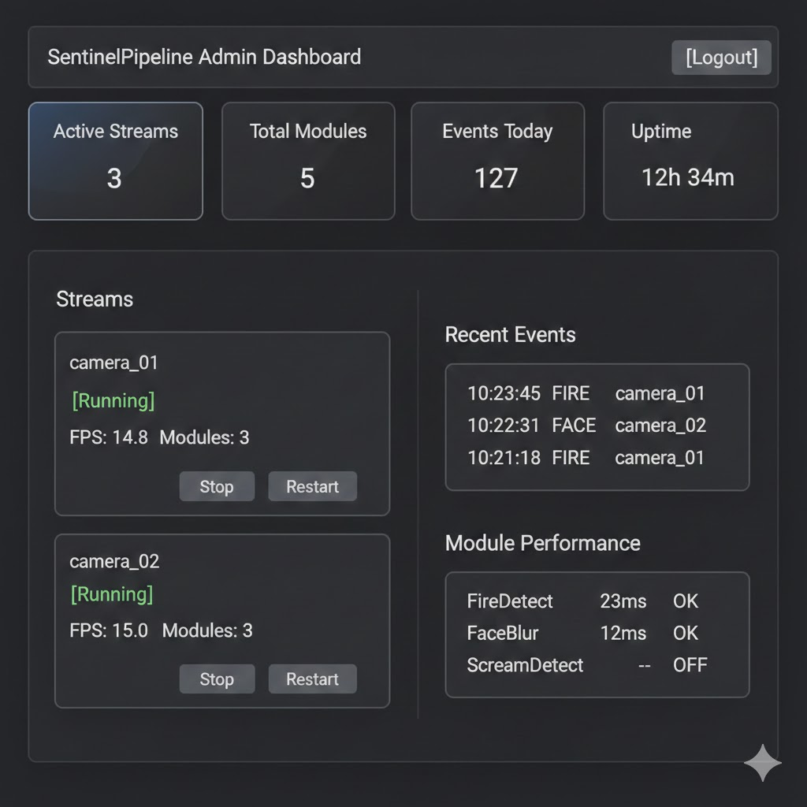

# SentinelPipeline 아키텍처

이 문서는 SentinelPipeline의 아키텍처 설계 원칙과 구조를 설명합니다.

---

## 설계 목표

SentinelPipeline은 다음 목표를 달성하기 위해 Clean Architecture를 채택하였습니다.

| 목표 | 설명 |
|------|------|
| 유지보수성 | 계층 분리로 변경 영향 범위를 최소화합니다 |
| 확장성 | 새로운 감지/변형 모듈을 플러그인 형태로 추가할 수 있습니다 |
| 테스트 용이성 | 각 계층을 독립적으로 테스트할 수 있습니다 |
| 커스터마이징 | 코드 수정 없이 설정 파일 교체만으로 동작을 변경할 수 있습니다 |

---

## Clean Architecture 개요

Clean Architecture는 Robert C. Martin(Uncle Bob)이 제안한 소프트웨어 설계 원칙입니다. 핵심은 **의존성 규칙(Dependency Rule)**입니다.

### 의존성 규칙

> 소스 코드 의존성은 반드시 안쪽(고수준)을 향해야 합니다.

```
┌─────────────────────────────────────────────────────────────┐
│                      Interface Layer                        │
│   (설정 로더, 메트릭, Health 엔드포인트, 실행 진입점)          │
├─────────────────────────────────────────────────────────────┤
│                   Infrastructure Layer                       │
│   (RTSP 디코더, FFmpeg, ONNX/PyTorch, HTTP/WS 클라이언트)    │
├─────────────────────────────────────────────────────────────┤
│                    Application Layer                         │
│   (파이프라인 엔진, 스케줄러, 스트림 관리자, 이벤트 발행자)     │
├─────────────────────────────────────────────────────────────┤
│                      Domain Layer                            │
│   (모듈 인터페이스, Event 모델, Stream 모델)                  │
└─────────────────────────────────────────────────────────────┘
                           ↑
                    의존성 방향 (안쪽으로)
```

바깥쪽 계층은 안쪽 계층을 참조할 수 있지만, 안쪽 계층은 바깥쪽 계층을 알지 못합니다.

---

## 계층별 상세 설명

### 1. Domain Layer

**위치**: `src/sentinel_pipeline/domain/`

**역할**: 비즈니스 규칙과 엔티티를 정의합니다. 가장 안쪽에 위치하며, 어떤 외부 라이브러리에도 의존하지 않습니다.

**구성 요소**:

| 파일 | 설명 |
|------|------|
| `interfaces/module.py` | 모든 처리 모듈이 구현해야 하는 인터페이스 |
| `models/event.py` | 감지 이벤트 데이터 구조 |
| `models/stream.py` | 스트림 상태 및 설정 모델 |

**ModuleBase 인터페이스**:

```python
class ModuleBase(Protocol):
    name: str           # 모듈 식별자
    enabled: bool       # 활성화 여부
    priority: int       # 실행 우선순위
    timeout_ms: int     # 처리 제한 시간
    options: dict       # 모듈별 설정

    def process_frame(self, frame, metadata: dict) -> tuple[Any, list[Event], dict]:
        """프레임을 처리하고 이벤트를 반환합니다"""
        ...

    def process_audio(self, chunk, metadata: dict) -> tuple[list[Event], dict]:
        """오디오 청크를 처리하고 이벤트를 반환합니다"""
        ...
```

**Event 모델**:

```python
@dataclass
class Event:
    type: str              # 이벤트 유형 (FIRE, SCREAM, INTRUSION 등)
    stage: EventStage      # DETECTED 또는 CONFIRMED
    confidence: float      # 신뢰도 (0.0 ~ 1.0)
    ts: float              # 타임스탬프
    stream_id: str         # 스트림 식별자
    module_name: str       # 이벤트를 생성한 모듈
    latency_ms: float      # 처리 지연 시간
    details: dict          # 추가 정보 (bbox, frame_number 등)
```

**의존성 규칙**:
- 표준 라이브러리만 사용 가능
- 외부 패키지 import 금지 (numpy, opencv 등)

---

### 2. Application Layer

**위치**: `src/sentinel_pipeline/application/`

**역할**: 유스케이스를 구현합니다. Domain Layer만 참조하며, 비즈니스 로직의 흐름을 조율합니다.

**구성 요소**:

| 디렉토리 | 파일 | 설명 |
|----------|------|------|
| `pipeline/` | `pipeline.py` | 파이프라인 엔진 - 모듈 순차 실행 |
| `pipeline/` | `scheduler.py` | 모듈 스케줄러 - priority 정렬, timeout 관리 |
| `stream/` | `manager.py` | 스트림 관리자 - 생명주기 관리 |
| `stream/` | `health.py` | 헬스 워처 - FPS 모니터링, 재연결 정책 |
| `event/` | `emitter.py` | 이벤트 발행자 - 큐 관리, 드롭 정책 |

**PipelineEngine 핵심 로직**:

```
1. 모듈을 priority 오름차순으로 정렬
2. enabled=True인 모듈만 필터링
3. 각 모듈에 대해:
   a. try/except로 감싸서 예외 격리
   b. timeout_ms 내에 완료되지 않으면 결과 폐기
   c. 실패 횟수가 임계치를 넘으면 모듈 자동 disable
4. 이벤트 수집 후 EventEmitter로 전달
5. 최종 프레임을 Publisher로 전달
```

**StreamManager 동시성 처리**:

```python
class StreamManager:
    def __init__(self):
        self._streams: dict[str, StreamContext] = {}
        self._lock = threading.Lock()

    def start_stream(self, stream_id: str, rtsp_url: str) -> None:
        with self._lock:
            # 스트림 시작 로직

    def stop_stream(self, stream_id: str) -> None:
        with self._lock:
            # join timeout 후 강제 kill
```

**의존성 규칙**:
- Domain Layer만 import 가능
- Infrastructure, Interface Layer import 금지

---

### 3. Infrastructure Layer

**위치**: `src/sentinel_pipeline/infrastructure/`

**역할**: 외부 시스템과의 연동을 담당합니다. 모든 외부 라이브러리는 이 계층에서만 사용합니다.

**구성 요소**:

| 디렉토리 | 파일 | 외부 의존성 |
|----------|------|-------------|
| `rtsp/` | `decoder.py` | OpenCV |
| `ffmpeg/` | `publisher.py` | subprocess (FFmpeg) |
| `inference/` | `onnx_runtime.py` | onnxruntime |
| `inference/` | `torch_runtime.py` | PyTorch |
| `transport/` | `http_client.py` | httpx |
| `transport/` | `ws_client.py` | websockets |

**RTSPDecoder 구조**:

```python
class RTSPDecoder:
    """OpenCV 기반 RTSP 스트림 디코더"""
    
    # 상수 정의
    TIMEOUT_MS = 5000
    BUFFER_SIZE = 1
    
    def connect(self, url: str) -> None:
        """RTSP 스트림에 연결합니다"""
        
    def read_frame(self) -> tuple[bool, np.ndarray | None]:
        """프레임을 읽습니다"""
        
    def release(self) -> None:
        """리소스를 해제합니다"""
```

**FFmpegPublisher 구조**:

```
[프레임 큐] ──> [stdin 파이프] ──> [FFmpeg 프로세스] ──> [RTSP 출력]
                    │
                    v
           write 예외 감지 → 재시작 (쿨다운 적용)
```

**의존성 규칙**:
- Domain Layer import 가능
- 외부 라이브러리 사용 가능
- Application Layer import 금지 (의존성 역전 필요 시 인터페이스 사용)

---

### 4. Interface Layer

**위치**: `src/sentinel_pipeline/interface/`

**역할**: 외부 세계와의 경계를 담당합니다. REST API, 설정 파일 로딩, 관측 기능, 실행 진입점을 제공합니다.

**구성 요소**:

| 디렉토리 | 파일 | 설명 |
|----------|------|------|
| `api/` | `app.py` | FastAPI 애플리케이션 팩토리 |
| `api/` | `dependencies.py` | 의존성 주입 설정 |
| `api/routes/` | `streams.py` | 스트림 제어 API |
| `api/routes/` | `config.py` | 설정 조회/변경 API |
| `api/routes/` | `health.py` | 헬스 체크 API |
| `config/` | `schema.py` | Pydantic v2 설정 스키마 |
| `config/` | `loader.py` | config.json 로딩 및 검증 |
| `observability/` | `metrics.py` | Prometheus 메트릭 정의 |

**설정 검증 정책**:

```
1. Pydantic v2로 config.json 검증
2. 잘못된 옵션은 안전 기본값으로 대체
3. 검증 실패 모듈은 skip 처리 + 경고 로그
4. 모듈별 options는 확장 가능한 dict[str, Any] 형태
```

**의존성 규칙**:
- 모든 내부 계층 import 가능
- 애플리케이션 조립(Composition Root) 역할 수행

---

## REST API 설계

FastAPI 기반의 HTTP API를 통해 외부에서 시스템을 제어할 수 있습니다. Clean Architecture 원칙에 따라 API 계층은 Interface Layer에 위치하며, Application Layer의 유스케이스를 호출합니다.

### API 구조

```
interface/api/
├── app.py              # FastAPI 앱 생성, 라우터 등록
├── dependencies.py     # 의존성 주입 (StreamManager, ConfigLoader 등)
└── routes/
    ├── streams.py      # /streams/* 엔드포인트
    ├── config.py       # /config/* 엔드포인트
    └── health.py       # /health, /metrics 엔드포인트
```

### 엔드포인트 목록

| 엔드포인트 | 메서드 | 설명 |
|-----------|--------|------|
| `/health` | GET | 시스템 상태 확인 (K8s liveness/readiness) |
| `/health/live` | GET | 프로세스 생존 확인 |
| `/health/ready` | GET | 서비스 준비 상태 확인 |
| `/streams` | GET | 전체 스트림 목록 및 상태 조회 |
| `/streams/{id}` | GET | 특정 스트림 상세 상태 조회 |
| `/streams/{id}/start` | POST | 스트림 시작 |
| `/streams/{id}/stop` | POST | 스트림 중지 |
| `/streams/{id}/restart` | POST | 스트림 재시작 |
| `/config` | GET | 현재 설정 전체 조회 |
| `/config` | PUT | 설정 전체 교체 (재시작 없이 적용) |
| `/config/modules/{name}` | GET | 특정 모듈 설정 조회 |
| `/config/modules/{name}` | PATCH | 특정 모듈 설정 변경 |
| `/config/modules/{name}/enable` | POST | 모듈 활성화 |
| `/config/modules/{name}/disable` | POST | 모듈 비활성화 |
| `/metrics` | GET | Prometheus 메트릭 노출 |

### API와 Clean Architecture

```
┌─────────────────────────────────────────────────────────────────┐
│                        Interface Layer                          │
│  ┌─────────────────────────────────────────────────────────┐   │
│  │                    FastAPI Router                        │   │
│  │  /streams/* ──> StreamController                         │   │
│  │  /config/*  ──> ConfigController                         │   │
│  │  /health    ──> HealthController                         │   │
│  └─────────────────────────────────────────────────────────┘   │
│                              │                                  │
│                              │ 의존성 주입                       │
│                              v                                  │
├─────────────────────────────────────────────────────────────────┤
│                      Application Layer                          │
│  StreamManager, ConfigManager, HealthService                    │
├─────────────────────────────────────────────────────────────────┤
│                      Domain Layer                               │
│  Stream, Event, Module 모델                                     │
└─────────────────────────────────────────────────────────────────┘
```

### 의존성 주입 패턴

```python
# interface/api/dependencies.py

from functools import lru_cache
from sentinel_pipeline.application.stream.manager import StreamManager
from sentinel_pipeline.interface.config.loader import ConfigLoader

@lru_cache
def get_stream_manager() -> StreamManager:
    """StreamManager 싱글톤 인스턴스 반환"""
    return StreamManager()

@lru_cache
def get_config_loader() -> ConfigLoader:
    """ConfigLoader 싱글톤 인스턴스 반환"""
    return ConfigLoader()
```

```python
# interface/api/routes/streams.py

from fastapi import APIRouter, Depends
from sentinel_pipeline.interface.api.dependencies import get_stream_manager

router = APIRouter(prefix="/streams", tags=["streams"])

@router.post("/{stream_id}/start")
async def start_stream(
    stream_id: str,
    manager: StreamManager = Depends(get_stream_manager)
):
    """스트림을 시작합니다"""
    manager.start_stream(stream_id)
    return {"status": "started", "stream_id": stream_id}
```

### 설정 동적 변경

설정 변경 시 재시작 없이 적용되어야 합니다. 이를 위해 ConfigManager가 런타임에 설정을 갱신하고, 각 컴포넌트에 변경을 전파합니다.

```
PUT /config 요청
     │
     v
ConfigController.update_config()
     │
     v
ConfigManager.reload()
     │
     ├──> PipelineEngine.reload_modules()
     │         - 모듈 재정렬
     │         - enabled 상태 갱신
     │
     └──> StreamManager.apply_config()
               - max_fps 갱신
               - downscale 갱신
```

### 응답 형식

모든 API 응답은 일관된 형식을 따릅니다.

**성공 응답**:

```json
{
  "success": true,
  "data": { ... },
  "message": "작업이 완료되었습니다"
}
```

**에러 응답**:

```json
{
  "success": false,
  "error": {
    "code": "STREAM_NOT_FOUND",
    "message": "스트림을 찾을 수 없습니다: camera_01"
  }
}
```

### 헬스 체크 응답

```json
{
  "status": "healthy",
  "version": "0.1.0",
  "uptime_seconds": 3600,
  "streams": {
    "camera_01": {
      "status": "running",
      "fps": 14.8,
      "last_frame_ts": 1702195200.123
    },
    "camera_02": {
      "status": "reconnecting",
      "retry_count": 2
    }
  },
  "modules": {
    "FireDetectModule": {"enabled": true, "error_count": 0},
    "FaceBlurModule": {"enabled": true, "error_count": 0}
  }
}
```

---

## 관리자 대시보드

FastAPI + Jinja2 기반의 웹 대시보드를 통해 시스템을 시각적으로 모니터링하고 제어할 수 있습니다.

### 대시보드 구조

```
interface/
├── api/
│   └── routes/
│       └── dashboard.py        # 대시보드 라우터
├── templates/                  # Jinja2 템플릿
│   ├── base.html               # 기본 레이아웃
│   ├── dashboard/
│   │   ├── index.html          # 메인 대시보드
│   │   ├── streams.html        # 스트림 관리
│   │   ├── modules.html        # 모듈 관리
│   │   ├── events.html         # 이벤트 로그
│   │   └── settings.html       # 설정 페이지
│   └── components/
│       ├── stream_card.html    # 스트림 카드 컴포넌트
│       ├── module_row.html     # 모듈 행 컴포넌트
│       └── event_item.html     # 이벤트 항목 컴포넌트
└── static/                     # 정적 파일
    ├── css/
    │   └── dashboard.css
    └── js/
        └── dashboard.js        # 실시간 업데이트 (WebSocket)
```

### 대시보드 페이지

| 경로 | 페이지 | 설명 |
|------|--------|------|
| `/admin` | 메인 대시보드 | 시스템 개요, 스트림/모듈 상태 요약 |
| `/admin/streams` | 스트림 관리 | 스트림 목록, 시작/중지/재시작 제어 |
| `/admin/modules` | 모듈 관리 | 모듈 상태, 활성화/비활성화, 설정 변경 |
| `/admin/events` | 이벤트 로그 | 실시간 이벤트 목록, 필터링, 검색 |
| `/admin/settings` | 설정 | 전역 설정 변경, 설정 내보내기/가져오기 |

### 메인 대시보드 기능




### 스트림 관리 페이지

| 기능 | 설명 |
|------|------|
| 스트림 목록 | 모든 스트림의 상태, FPS, 에러 카운트 표시 |
| 스트림 시작/중지 | 버튼 클릭으로 스트림 제어 |
| 스트림 추가 | 새 RTSP URL로 스트림 추가 |
| 스트림 삭제 | 스트림 설정 제거 |
| 상세 정보 | 스트림별 상세 통계, 최근 이벤트 |

### 모듈 관리 페이지

| 기능 | 설명 |
|------|------|
| 모듈 목록 | 등록된 모든 모듈 상태 표시 |
| 활성화/비활성화 | 토글 스위치로 모듈 제어 |
| 설정 변경 | 모듈별 옵션 편집 (threshold, timeout 등) |
| 성능 통계 | 평균 처리 시간, 에러율, 이벤트 발생 수 |
| 우선순위 변경 | 드래그 앤 드롭으로 실행 순서 변경 |

### 이벤트 로그 페이지

| 기능 | 설명 |
|------|------|
| 실시간 로그 | WebSocket으로 새 이벤트 실시간 수신 |
| 필터링 | 이벤트 유형, 스트림, 모듈별 필터 |
| 검색 | 기간, 키워드로 검색 |
| 상세 보기 | 이벤트 세부 정보 (bbox, confidence 등) |
| 내보내기 | CSV, JSON 형식으로 다운로드 |

### 실시간 업데이트 (WebSocket)

대시보드는 WebSocket을 통해 실시간 데이터를 수신합니다.

```javascript
// static/js/dashboard.js

const ws = new WebSocket(`ws://${window.location.host}/ws/dashboard`);

ws.onmessage = (event) => {
    const data = JSON.parse(event.data);
    
    switch (data.type) {
        case 'stream_update':
            updateStreamCard(data.stream_id, data.status);
            break;
        case 'event':
            appendEventLog(data.event);
            break;
        case 'module_stats':
            updateModuleStats(data.modules);
            break;
        case 'metrics':
            updateMetricsChart(data.metrics);
            break;
    }
};
```

### WebSocket 메시지 형식

**스트림 상태 업데이트**:

```json
{
  "type": "stream_update",
  "stream_id": "camera_01",
  "status": "running",
  "fps": 14.8,
  "frame_count": 12345
}
```

**이벤트 발생**:

```json
{
  "type": "event",
  "event": {
    "type": "FIRE",
    "stream_id": "camera_01",
    "confidence": 0.87,
    "ts": 1702195200.123
  }
}
```

**모듈 통계**:

```json
{
  "type": "module_stats",
  "modules": {
    "FireDetectModule": {
      "avg_exec_ms": 23.5,
      "error_count": 0,
      "event_count": 127
    }
  }
}
```

---

## 플러그인 시스템

플러그인은 Domain Layer의 `ModuleBase` 인터페이스를 구현하지만, Infrastructure Layer의 외부 라이브러리를 사용할 수 있습니다.

**위치**: `src/sentinel_pipeline/plugins/`

**구조**:

```
plugins/
├── detect/
│   ├── fire_detect.py      # 화재 감지
│   └── scream_detect.py    # 비명 감지
└── transform/
    └── face_blur.py        # 얼굴 블러
```

**플러그인 등록 흐름**:

```
1. config.json의 modules 배열에서 모듈 설정 로드
2. 모듈 이름으로 플러그인 클래스 검색
3. 설정값으로 인스턴스 생성
4. PipelineEngine에 등록
```

---

## 데이터 흐름

```
┌──────────┐     ┌──────────────┐     ┌──────────────┐     ┌──────────────┐
│  RTSP    │────>│  Pipeline    │────>│   FFmpeg     │────>│ Flashphoner  │
│  Source  │     │   Engine     │     │  Publisher   │     │   (출력)     │
└──────────┘     └──────┬───────┘     └──────────────┘     └──────────────┘
                        │
                        │ 이벤트 발생 시
                        v
                 ┌──────────────┐     ┌──────────────┐
                 │    Event     │────>│   Java VMS   │
                 │   Emitter    │     │  (HTTP/WS)   │
                 └──────────────┘     └──────────────┘
```

**프레임 처리 순서**:

1. RTSPDecoder가 프레임 수신
2. StreamManager가 프레임을 PipelineEngine에 전달
3. PipelineEngine이 등록된 모듈을 priority 순으로 실행
4. 각 모듈이 프레임 처리 및 이벤트 생성
5. 최종 프레임을 FFmpegPublisher로 전달
6. 생성된 이벤트를 EventEmitter로 전달
7. EventEmitter가 HTTP/WebSocket으로 VMS에 전송

---

## 장애 처리 전략

### 모듈 장애 격리

```python
try:
    result = module.process_frame(frame, metadata)
except Exception as e:
    logger.error(f"모듈 {module.name} 처리 실패: {e}")
    module.error_count += 1
    if module.error_count > MAX_ERRORS:
        module.enabled = False
        logger.warning(f"모듈 {module.name} 자동 비활성화")
```

### 스트림 재연결 (지수 백오프)

```python
def calculate_delay(retry_count: int, base_delay: float, max_delay: float) -> float:
    """지수 백오프 지연 시간 계산"""
    delay = base_delay * (2 ** retry_count)
    return min(delay, max_delay)

# 예: base_delay=1, max_delay=8
# retry 0: 1초
# retry 1: 2초
# retry 2: 4초
# retry 3: 8초 (최대)
```

### FFmpeg 재시작 정책

```
1. write 예외 또는 정체 감지 시 재시작
2. 재시작 한계 도달 시 쿨다운 대기
3. 쿨다운 후 재시작 카운터 리셋
```

---

## 디렉토리 구조 요약

```
src/sentinel_pipeline/
├── domain/                     # 핵심 비즈니스 규칙
│   ├── interfaces/
│   │   └── module.py
│   └── models/
│       ├── event.py
│       └── stream.py
├── application/                # 유스케이스
│   ├── pipeline/
│   │   ├── pipeline.py
│   │   └── scheduler.py
│   ├── stream/
│   │   ├── manager.py
│   │   └── health.py
│   ├── config/
│   │   └── manager.py          # 설정 동적 변경 관리
│   └── event/
│       └── emitter.py
├── infrastructure/             # 외부 연동
│   ├── rtsp/
│   │   └── decoder.py
│   ├── ffmpeg/
│   │   └── publisher.py
│   ├── inference/
│   │   ├── onnx_runtime.py
│   │   └── torch_runtime.py
│   └── transport/
│       ├── http_client.py
│       └── ws_client.py
├── interface/                  # API, 설정, 관측, 진입점
│   ├── api/
│   │   ├── app.py              # FastAPI 앱
│   │   ├── dependencies.py     # 의존성 주입
│   │   └── routes/
│   │       ├── streams.py      # 스트림 제어 API
│   │       ├── config.py       # 설정 API
│   │       ├── health.py       # 헬스 체크 API
│   │       └── dashboard.py    # 관리자 대시보드
│   ├── templates/              # Jinja2 템플릿
│   │   ├── base.html
│   │   └── dashboard/
│   │       ├── index.html
│   │       ├── streams.html
│   │       ├── modules.html
│   │       └── events.html
│   ├── static/                 # 정적 파일
│   │   ├── css/
│   │   └── js/
│   ├── config/
│   │   ├── schema.py
│   │   └── loader.py
│   └── observability/
│       └── metrics.py
├── plugins/                    # 확장 모듈
│   ├── detect/
│   │   ├── fire_detect.py
│   │   └── scream_detect.py
│   └── transform/
│       └── face_blur.py
└── main.py
```

